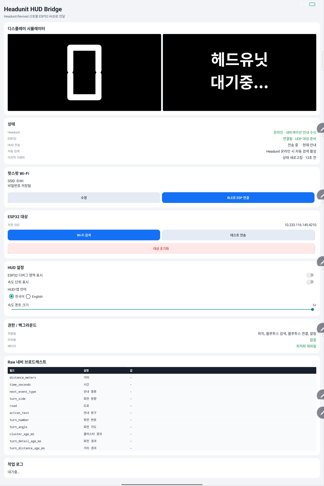
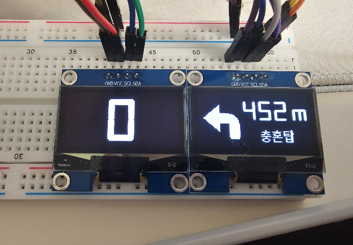

# Headunit Revived ESP32 HUD

[English](README.md) | [한국어](README.ko.md)

Headunit Revived의 내비게이션 안내를 ESP32 기반 소형 OLED HUD에 표시하는 Android-to-ESP32 브리지입니다.

이 프로젝트는 Headunit Revived를 포크하지 않는 실험적 companion stack입니다. 태블릿에 설치된 Android 앱이 Headunit Revived 내비게이션 브로드캐스트를 수신하고, 이를 compact UDP 패킷으로 변환한 뒤 ESP32 펌웨어로 전송합니다. ESP32는 수신한 패킷을 속도/안내 OLED 화면에 렌더링합니다.

## 프로젝트 상태

- 하드웨어 대상: ESP32-S3-N16R8 계열 보드.
- 디스플레이 대상: 128x64 I2C OLED 2개, 물리 배치 `[1] [2]`.
- Android 대상: Headunit Revived와 이 브리지 앱이 설치된 태블릿.
- 전송 방식: 최초 Wi-Fi 설정은 BLE, 실시간 HUD 데이터는 UDP.
- 안정성: active prototype. 패킷 필드는 추가 방식으로 확장하며 backward compatibility를 유지합니다.

## 저장소 구조

| 경로 | 역할 |
| --- | --- |
| `android-app/` | Headunit Revived 브로드캐스트 수신, ESP32 BLE provisioning, Wi-Fi discovery, 실시간 HUD 패킷 전송을 담당하는 Kotlin Android 앱. |
| `bridge-core/` | 패킷, 상태, 타이밍, 매핑 로직을 담은 순수 Kotlin 모듈과 unit test. |
| `esp32-hud/` | ESP32-S3용 PlatformIO 펌웨어. BLE provisioning, Wi-Fi reconnect, UDP discovery, packet parsing, OLED rendering을 담당합니다. |
| `docs/setup.md` | Android, ESP32, OLED wiring, network troubleshooting 설정 가이드. |
| `docs/protocol.md` | broadcast, BLE provisioning, UDP HUD packet, discovery, settings, speed packet wire protocol reference. |

## 동작 흐름

1. ESP32가 Bluetooth LE로 `Headunit HUD`를 advertise합니다.
2. Android 앱이 BLE로 phone hotspot credentials를 ESP32에 씁니다.
3. ESP32가 Wi-Fi에 연결하고 UDP listener를 시작합니다.
4. Android 앱이 UDP port `4211`로 ESP32 target을 discovery합니다.
5. Headunit Revived가 태블릿에서 내비게이션 브로드캐스트를 발행합니다.
6. 브리지 앱이 브로드캐스트를 compact JSON HUD packet으로 변환합니다.
7. ESP32가 port `4210`에서 UDP packet을 받고, stale sequence number를 무시한 뒤 HUD를 렌더링합니다.

HUD packet은 fire-and-forget 방식입니다. ESP32는 실시간 내비게이션 패킷에 ACK를 보내지 않으므로, 지연된 return traffic이 현재 안내를 늦추지 않습니다.

## 스크린샷

| Android bridge dashboard | ESP32 OLED HUD |
| --- | --- |
| [](docs/assets/bridge-screen.png) | [](docs/assets/hud.png) |

이미지를 누르면 원본 크기로 열 수 있습니다.

## 빠른 시작

Android 쪽 build/test:

```powershell
.\gradlew.bat :bridge-core:test :android-app:testDebugUnitTest :android-app:assembleDebug --warning-mode all
```

ESP32 firmware build:

```powershell
platformio run -d esp32-hud -e esp32-s3-n16r8
```

ESP32 firmware flash:

```powershell
platformio run -d esp32-hud -e esp32-s3-n16r8 -t upload
```

Android APK build에는 `ANDROID_HOME` 또는 `local.properties`로 설정된 Android SDK가 필요합니다. ESP32 build에는 PlatformIO가 필요합니다.

## 하드웨어 메모

기본 OLED driver는 SH1106입니다. SSD1306-compatible로 판매되는 많은 1.3 inch 128x64 모듈이 실제로는 SH1106 controller를 사용하기 때문입니다. 핀, address, driver가 다른 경우 `esp32-hud/include/config.h`에서 display configuration을 override하세요.

기본 display role:

| Display | Role | Default bus |
| --- | --- | --- |
| 1 | Speed and safety face | GPIO 8/9, `0x3C` |
| 2 | Navigation face | GPIO 10/11, `0x3C` |

## 문서

- Setup guide: [English](docs/setup.md) | [한국어](docs/setup.ko.md)
- Protocol reference: [English](docs/protocol.md) | [한국어](docs/protocol.ko.md)

## 기여

이슈와 pull request는 환영합니다. 이 프로젝트에서 좋은 기여는 보통 다음을 포함합니다.

- 명확한 hardware/software setup 설명,
- runtime 문제에 대한 log 또는 screenshot,
- bridge logic 변경에 대한 Android unit test,
- firmware 변경에 대한 PlatformIO compile verification,
- packet field가 바뀔 때 protocol documentation update.

secret은 commit하지 마세요. Wi-Fi SSID, password, local SDK path, signing key, device-specific private IP address를 저장소에 넣지 않습니다.

## 라이선스

아직 license file이 선택되지 않았습니다. license가 추가되기 전까지는 코드를 review와 collaboration을 위한 source-available 상태로 보고, 광범위한 재배포 라이선스가 부여된 것으로 간주하지 마세요.
